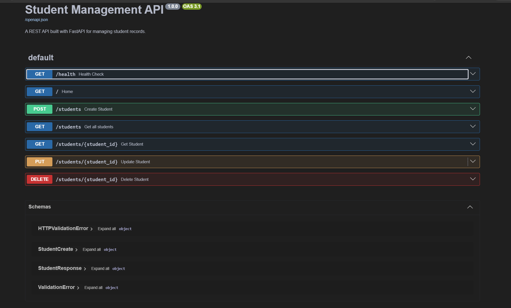
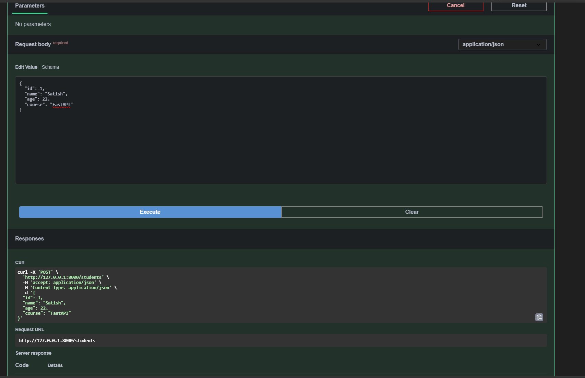

# Student Management API 🚀

A REST API built using **FastAPI** and **SQLAlchemy** for managing student records. This project demonstrates backend development concepts including REST API design, database integration, CRUD operations, and API validation.

## 🚀 Features

* Create student records
* Retrieve all students
* Retrieve student by ID
* Update student details
* Delete student records
* SQLite database integration
* Data validation using Pydantic
* Interactive API documentation using Swagger UI

## 🛠️ Tech Stack

* Python
* FastAPI
* SQLAlchemy
* Pydantic
* SQLite
* Uvicorn

## 📂 Project Structure

```text
student-management-api/

├── main.py              # FastAPI application and routes
├── database.py          # Database connection setup
├── models.py            # SQLAlchemy database models
├── schemas.py           # Pydantic schemas
├── crud.py              # CRUD database operations
├── requirements.txt     # Dependencies
├── README.md            # Documentation
└── screenshots/
    ├── swagger.png
    └── create-student.png
```

## ⚙️ Installation and Setup

### Clone the repository

```bash
git clone https://github.com/satish-ayyaluri/student-management-api.git
```

### Navigate to the project

```bash
cd student-management-api
```

### Create virtual environment

```bash
python -m venv .venv
```

### Activate virtual environment

Windows:

```bash
.venv\Scripts\activate
```

### Install dependencies

```bash
pip install -r requirements.txt
```

## ▶️ Run the Application

Start the FastAPI server:

```bash
python -m uvicorn main:app --reload
```

API will run at:

```
http://127.0.0.1:8000
```

## 📖 API Documentation

FastAPI provides interactive Swagger documentation:

```
http://127.0.0.1:8000/docs
```

## 📸 Screenshots

### Swagger API Documentation



### Create Student API Response



## 🔗 API Endpoints

| Method | Endpoint                 | Description       |
| ------ | ------------------------ | ----------------- |
| POST   | `/students`              | Create a student  |
| GET    | `/students`              | Get all students  |
| GET    | `/students/{student_id}` | Get student by ID |
| PUT    | `/students/{student_id}` | Update student    |
| DELETE | `/students/{student_id}` | Delete student    |

## 📌 Example Request

### Create Student

```json
{
  "name": "Satish",
  "age": 22,
  "course": "FastAPI"
}
```

### Example Response

```json
{
  "id": 1,
  "name": "Satish",
  "age": 22,
  "course": "FastAPI"
}
```

## 🎯 Learning Outcomes

Through this project, I learned:

* Building REST APIs with FastAPI
* Creating CRUD operations
* Working with SQLAlchemy ORM
* Connecting APIs with databases
* Testing APIs using Swagger UI
* Structuring a Python backend project

## 👨‍💻 Author

**Ayyaluri Satish Kumar Reddy**

GitHub: https://github.com/satish-ayyaluri
